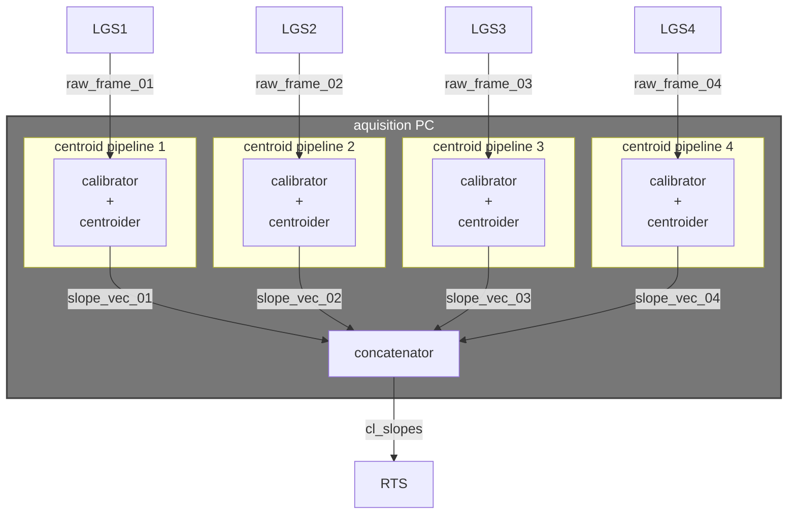
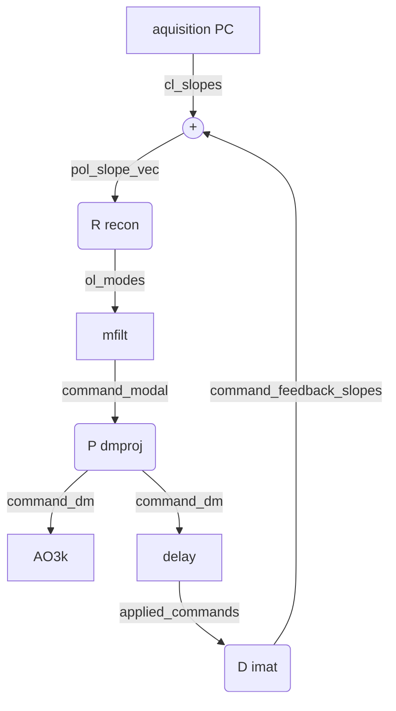

# ULTIMATE Subaru RTS devtools
This repository is a collection of tools/scripts for developing and testing the 
RTS pipelines for the LTAO system of Subaru (ULTIMATE-START and ULTIMATE-GLAO).

## Install
Install requirements and centroider CLI:
```bash
pip install -e .
```

Install the `ltaomodcentroider` package for [milk](https://github.com/milk-org/milk):
```
./compile.sh
cd build
sudo make install
```
Note: the above should be changed to be in the proper format of a milk-plugin.

## Centroiding
The current implementation of the centroider for ULTIMATE-START resides in the 
milk module in this repo under `./ltaomod_centroider`. This directory is used only
to edit the centroider algorithm, or other low level algorithms on the aquisition
PC.

For interacting with the centroider, including:
- launching it,
- stopping it, 
- editing the configuration parameters,
- *etc*.,

there is a Python-written CLI. Installing the Python package from this repository 
(see [instructions above](#Setup)) exposes the `cent` executable, e.g.:
```echo
$ cent --help
usage: cent <command> [<args>]

The valid commands are:
     start     Try to start the centroiders
      stop     Try to stop the centroiders
    config     load/save the centroider config from/to a file
    status     Print current status of centroider
      wgui     Launch centroider ui
     recon     Run the local reconstructor for a while

positional arguments:
  command        Subcommand to run

options:
  -h, --help     show this help message and exit
  --verbose, -v  verbosity level

```

The centroider is a standard milk functions, so for each WFS, there is an associated
milk-FPS defined during runtime. E.g., a normal startup will look like:
```echocent start
```


The pipeline proposed for the centroiding is:

with the possibility of combining the `calibrator` and `centroider` processes into a single `calibrate_and_centroid` process. The `concatenator` process would also be required to synchronize the 4 input streams before passing the slope vector to the RTS.

## Tomographic Reconstruction
For developing the tomographic reconstructor/pseudo-open-loop controller (POLC) we'll take a similar approach as the centroider, where we will build a process that writes to the slope vector in shared memory, triggering the start of a control iteration in the RTS.

The control pipeline proposed for the reconstructor is:

with the possibility of combining the `calibrator` and `centroider` processes into a single `calibrate_and_centroid` process. The `concatenator` process would also be required to synchronize the 4 input streams before passing the slope vector to the RTS.

## TODO:
 - C-profiling/benchmarking for `centroider.c`
 - Simple closed-loop RTS, no POLC.
 - Allow centroider FPS to be created without shm initialised yet.