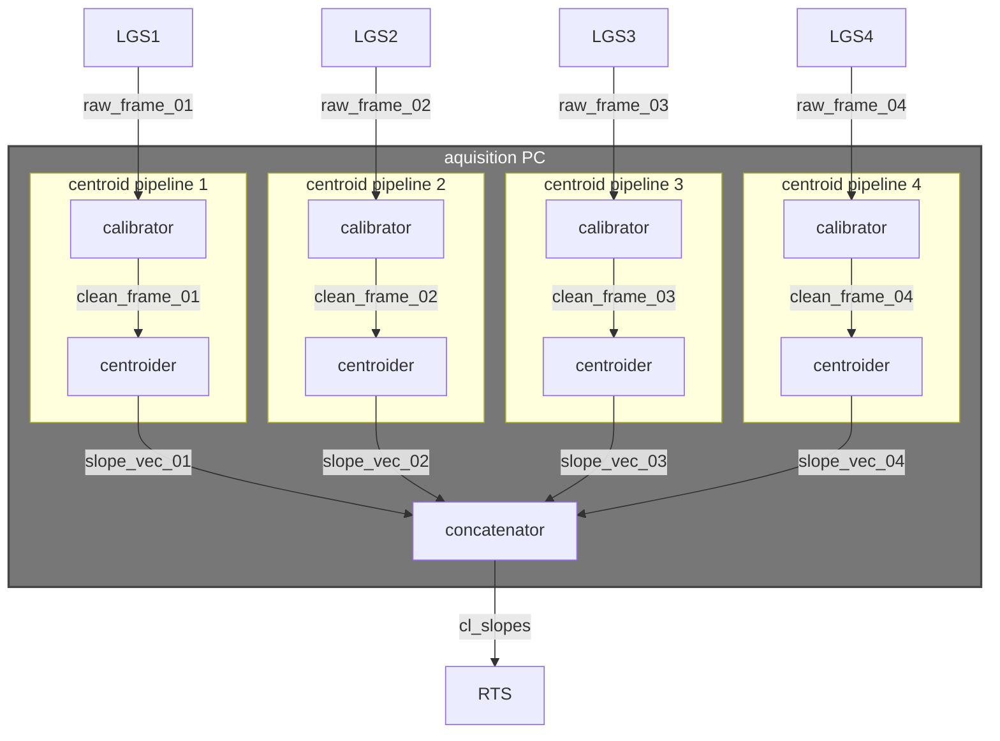
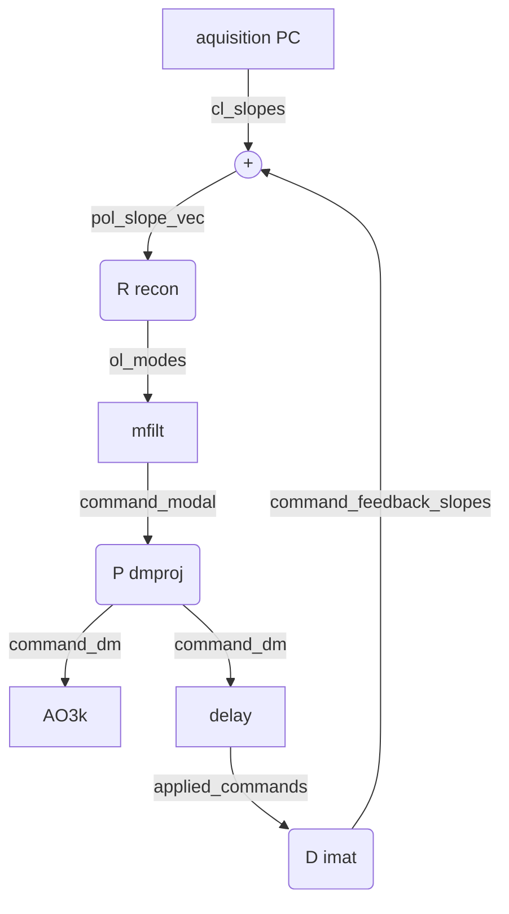

# ULTIMATE Subaru RTS devtools
This repository is a collection of tools/scripts for developing and testing the RTS pipelines for the LTAO system of Subaru (ULTIMATE-START and ULTIMATE-GLAO).

<p align="center">
    
</p>

## Setup
Install requirements:
```bash
pip install -r requirements.txt
```

## Python scripts
Run a script, e.g., to build WFS simulator telemetry:
```bash
cd ./scripts
python ./make_simulated_data.py
```

## Centroiding
For developing a centroiding process, we've decided that it would be useful to have a process that dumps WFS images to shm, so that they can be fetched by a centroider which can in-turn save a slope vector to disk.

The pipeline proposed for the centroiding is:

with the possibility of combining the `calibrator` and `centroider` processes into a single `calibrate_and_centroid` process. The `concatenator` process would also be required to synchronize the 4 input streams before passing the slope vector to the RTS.

## Tomographic Reconstruction
For developing the tomographic reconstructor/pseudo-open-loop controller (POLC) we'll take a similar approach as the centroider, where we will build a process that writes to the slope vector in shared memory, triggering the start of a control iteration in the RTS.

The control pipeline proposed for the reconstructor is:

with the possibility of combining the `calibrator` and `centroider` processes into a single `calibrate_and_centroid` process. The `concatenator` process would also be required to synchronize the 4 input streams before passing the slope vector to the RTS.

## Replay telemetry buffer
Replay a saved telemetry buffer, e.g., a simulated one. Data will be pushed to shared memory at 500 Hz. See screenshot above.

Replay a simulation:
```bash
./replay_simulation.sh
```
or, e.g.,
```bash
./replay_wfs00.sh
```


## Known Issues
 - `./replay_simulation.sh` will fail the first time after reboot, because `shmImshow.py lgswfs*` will try to load streams that haven't been created yet. Hack fix is to do:
 ```bash
 ./replay_all.sh
 ## this will start replaying the buffer, but fail to show the images
 ## ...
 ## wait for ~10 seconds
 ## ...
 ## then:
 tmux kill-session -t replay
 ./replay_all.sh
 ```
 Note that you need to run `./scripts/make_simulated_data.py` first to save the simulated telemetry to disk.

## TODO:
 - C-profiling/benchmarking for `centroider.c`
 - `procCTRL`-ify the centroider,
 - Simple closed-loop RTS, no POLC.