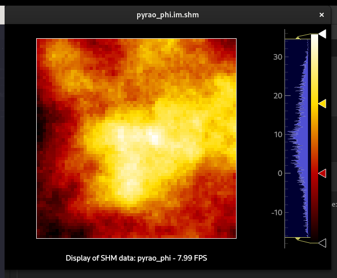

## Setup
This simulator is based on [pyrao](https://github.com/jcranney/pyrao), which is not yet on the Python Package Index (PyPI), though you should be able to install it via pip with:
```
pip install maturin
git clone https://github.com/jcranney/pyrao _pyrao
cd _pyrao
maturin develop --release
pip install -e .
cd ..
```
This requires pip, [pyMilk](https://github.com/milk-org/pyMilk), and [cargo](https://rustup.rs/) to be installed.

## Quickstart
To run the simulator itself, do, e.g.:
```bash
python ./simulator.py --device="cuda:0"
```
to run on the first available CUDA GPU on your machine. To use CPU (e.g., if you don't have CUDA GPU), simply use:
```bash
python ./simulator.py # --device="cuda"
# or:
python ./simulator.py --device="cpu"
```

This will simulate an AO system with the same dimensions as Ultimate-START, saving slope vectors to SHM under "pyrao_meas", and will block the progress of the simulator until "pyrao_com" is updated.

## Run options
### Non-blocking
If you would like to run the simulator asynchronously (not *blocking* for pyrao_com), you can pass the "--async" flag. You can, for example, check that everything has installed correctly by running:
```bash
python ./simulator.py --nonblocking
```
which will set the AO loop off, you should see an output like:
```
doing c_phi_phi matrix
doing c_phip1_phi matrix
doing c_meas_phi matrix
doing d_meas_com matrix
doing d_phi_com matrix
wfe: 9.468 rad: : 996it [00:14, 69.91it/s]
```
if all goes well. 

### Quiet
If the display is bothering you, turn it off with the `--quiet` flag.

## Going deeper
If you are able to open display windows, then you can run:
```bash
shmImshow.py pyrao_phi
```
which will display the residual wavefront on-axis (from shared memory), updated in real time:
<center>
</img>
</center>

To interact with the simulator, you can directly modify the `pyrao_com` vector, usually located at `/milk/shm/pyrao_com.im.shm`. For example, you can wiggle an actuator with the following python snippet (from a new terminal session, for example):
```python
from pyMilk.interfacing.shm import SHM
com_shm = SHM("pyrao_com")
meas_shm = SHM("pyrao_meas")
# get command vector from shm:
com = com_shm.get_data()
for i in range(100):
    # request an updated slope vector from shm, and block
    # until it is available
    meas_shm.get_data(check=True)
    # poke an actuator in the command vector
    com[1000] = i
    # send those commands to shm
    com_shm.set_data(com)
```
